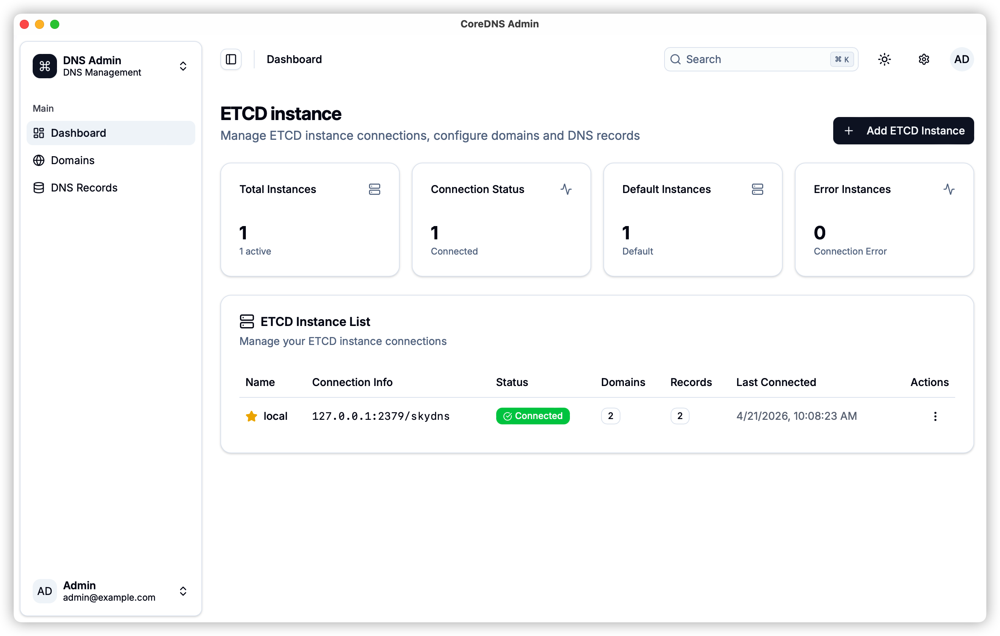
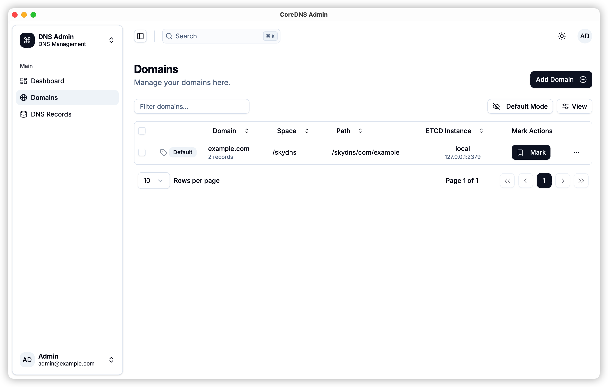
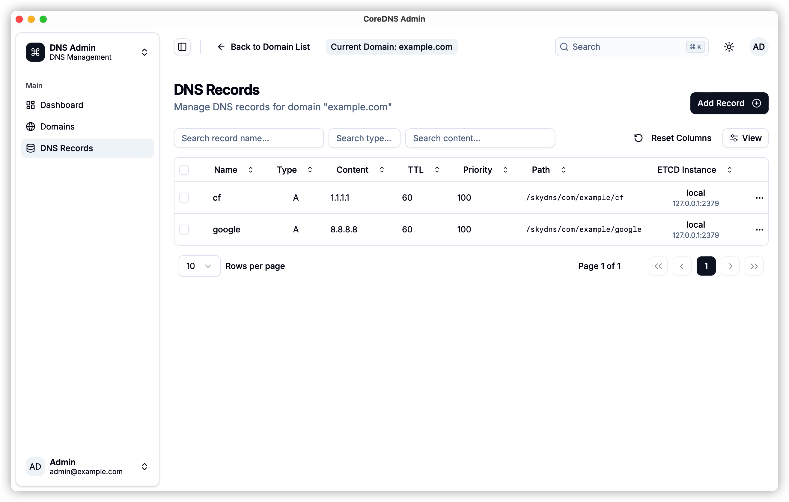
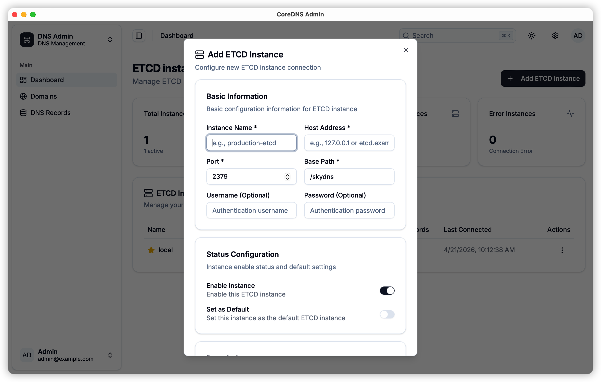
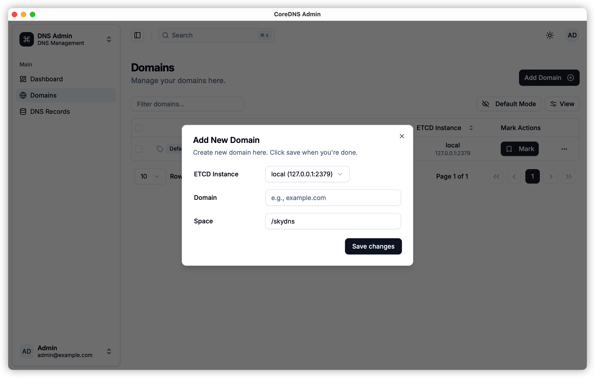
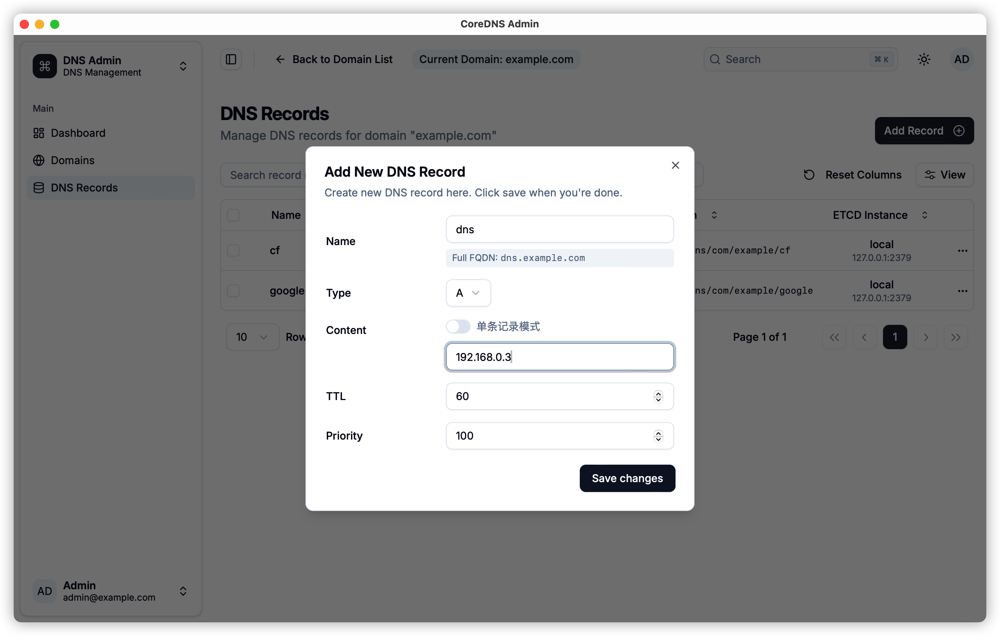

<div align="center">

# CoreDNS Admin - Modern DNS Management Platform

</div>

<div align="center">

[](https://hub.docker.com)
[](https://opensource.org/licenses/MIT)
[](https://python.org/)
[](https://reactjs.org/)
[](https://www.typescriptlang.org/)
[](https://tauri.app/)
[](https://github.com/zhengxiongzhao/coredns-admin/releases)
[](https://github.com/zhengxiongzhao/coredns-admin/releases)
[](https://github.com/zhengxiongzhao/coredns-admin/releases)

[English](README.md) | [中文](README.zh-CN.md)

</div>

---

## 📖 Project Introduction

### Modern DNS Management for CoreDNS

CoreDNS Admin is a cross-platform DNS management platform for CoreDNS records stored in Etcd. It supports both **Docker deployment** and **native desktop applications** (macOS / Windows / Linux), providing an intuitive interface for managing DNS records, domains, and Etcd instances with advanced features like conflict detection, multi-record support, and virtual domain management.

### Platform Support

| Platform | Type | How to Get |
|----------|------|------------|
| **Docker** | Server deployment | `docker pull zhengxiongzhao/coredns-admin` |
| **macOS** (Apple Silicon / Intel) | Desktop App | [GitHub Releases](https://github.com/zhengxiongzhao/coredns-admin/releases) (.dmg) |
| **Windows** | Desktop App | [GitHub Releases](https://github.com/zhengxiongzhao/coredns-admin/releases) (.msi / .exe) |
| **Linux** | Desktop App | [GitHub Releases](https://github.com/zhengxiongzhao/coredns-admin/releases) (.deb / .AppImage) |


### Core Features

1. [**Unified DNS Management**](docs/features/dns-management.md): Manage A, AAAA, CNAME, MX, TXT, SRV, NS, PTR, and SOA records with intelligent validation
2. [**Domain Discovery**](docs/features/domain-discovery.md): Automatic discovery and organization of domains from Etcd storage
3. [**Conflict Detection**](docs/features/conflict-detection.md): Smart detection of DNS record conflicts to prevent resolution issues
4. [**Multi-Record Support**](docs/features/multi-records.md): Support for multiple records with the same name using CoreDNS-compatible sequencing
5. [**Virtual Domains**](docs/features/virtual-domains.md): Manual domain marking and virtual domain management for complex hierarchies

---

## ⭐ Features

### 📸 Screenshots

Here are some screenshots of CoreDNS Admin in action:

<table>
  <tr>
    <td align="center">
      <a href="docs/screenshots/1.png">
        
      </a>
      <br/>
      Etcd Instance Management
    </td>
    <td align="center">
      <a href="docs/screenshots/2.png">
        
      </a>
      <br/>
      Domain Management
    </td>
  </tr>
  <tr>
    <td align="center">
      <a href="docs/screenshots/3.png">
        
      </a>
      <br/>
      DNS Records Management
    </td>
    <td align="center">
      <a href="docs/screenshots/4.png">
        
      </a>
      <br/>
      Add Etcd Instance
    </td>
  </tr>
  <tr>
    <td align="center">
      <a href="docs/screenshots/5.png">
        
      </a>
      <br/>
      Add Domain
    </td>
    <td align="center">
      <a href="docs/screenshots/6.png">
        
      </a>
      <br/>
      Add DNS Record
    </td>
  </tr>
</table>

---

### 🚀 DNS Record Types

| Record Type | Status | Description | Validation |
|-------------|--------|-------------|------------|
| **A** | ✅ Done | IPv4 address records | Full RFC compliance |
| **AAAA** | ✅ Done | IPv6 address records | Full RFC compliance |
| **CNAME** | ✅ Done | Canonical name records | Domain format validation |
| **MX** | ✅ Done | Mail exchange records | Priority + domain validation |
| **TXT** | ✅ Done | Text records | Content validation |
| **SRV** | ✅ Done | Service records | Priority/weight/port validation |
| **NS** | ✅ Done | Name server records | Domain format validation |
| **PTR** | ✅ Done | Pointer records | Domain format validation |
| **SOA** | ✅ Done | Start of authority records | Multi-field validation |

---

### 🔧 Advanced Features

| Feature | Technical Implementation | Business Value |
|---------|-------------------------|----------------|
| **Conflict Detection** | Smart analysis of CoreDNS resolution behavior | Prevents DNS resolution issues |
| **Multi-Record Support** | CoreDNS-compatible `_record_XX` sequencing | Load balancing and redundancy |
| **Virtual Domains** | Manual domain marking system | Flexible domain hierarchy management |
| **Batch Operations** | Bulk record creation and management | 90% time savings for large deployments |
| **Real-time Validation** | Client and server-side validation | 95% reduction in configuration errors |

---

### 🛡️ Security Features

| Security Feature | Implementation |
|------------------|----------------|
| **Authentication** | JWT-based authentication with configurable expiration |
| **Authorization** | Role-based access control (RBAC) |
| **API Security** | CORS protection and input validation |
| **Data Protection** | Secure Etcd connections and data encryption |

---

## 🚀 Deployment Guide

### 🐳 Quick Start with Docker Hub Image

Use the pre-built image from Docker Hub for the fastest setup:

```yaml
# docker-compose.yml
services:
  coredns-admin:
    image: zhengxiongzhao/coredns-admin:latest
    ports:
      - "3000:3000"
    environment:
      - ADMIN_USERNAME=${ADMIN_USERNAME:-admin}
      - ADMIN_PASSWORD=${ADMIN_PASSWORD:-admin123}
    volumes:
      - /etc/localtime:/etc/localtime:ro
      - admin-data:/app/data
    networks:
      - coredns-network

volumes:
  admin-data:
    driver: local

networks:
  coredns-network:
    driver: bridge
```

```bash
docker-compose up -d
```

Access: **http://localhost:3000**

- **UserName**: admin
- **Password**: admin123

---

### 💻 Local Development Deployment

Perfect for developers who want to contribute or customize the platform.

#### Prerequisites

- Docker and Docker Compose
- Node.js 20+ (for frontend development)
- Python 3.11+ (for backend development)
- Rust (for Tauri desktop builds)

#### Quick Start with Docker Compose

```bash
# Clone the repository
git clone https://github.com/coredns-admin/coredns-admin.git
cd coredns-admin

# Start all services
docker-compose up -d

# Access the application
# Web UI: http://localhost:3000
# API:    http://localhost:3000/api
# CoreDNS: localhost:5053
```

#### Default Credentials

- **Username**: admin
- **Password**: admin123

---

### 🖥️ Production Deployment

For production environments with high availability requirements.

#### Architecture Components

The unified Docker image bundles frontend, backend, Nginx, and Supervisord into a single container.

| Component | Purpose | Port |
|-----------|---------|------|
| **Nginx** | Reverse proxy + static files | 3000 (exposed) |
| **Backend** | Flask API (Uvicorn) | 55000 (internal) |
| **CoreDNS** | DNS server | 53/5053 |
| **Etcd** | Distributed key-value store | 2379 |

#### Docker Compose Production

```bash
# Clone project
git clone https://github.com/coredns-admin/coredns-admin.git
cd coredns-admin

# Configure environment variables
cp .env.example .env
# Edit .env with your production settings

# Start production services
docker-compose -f docker-compose.yml up -d

# Check service status
docker-compose ps
```

#### Environment Configuration

```bash
# Backend Configuration
ADMIN_USERNAME=your-admin-username
ADMIN_PASSWORD=your-secure-password
ADMIN_EMAIL=admin@yourdomain.com
JWT_SECRET_KEY=your-jwt-secret-key
JWT_EXPIRATION_HOURS=24


# Frontend Configuration
VITE_API_BASE_URL=https://api.yourdomain.com
```

---

## 📖 Usage Guide

### Initial Setup

1. **Access the Web Interface**
   ```
   http://localhost:3000
   ```

2. **Login with Admin Credentials**
   - Use the default credentials or your configured admin account

3. **Configure Etcd Connection**
   - Navigate to Etcd Instances management
   - Add your Etcd cluster endpoints
   - Test connection and save configuration

### DNS Record Management

#### Creating DNS Records

1. **Navigate to DNS Records**
2. **Select Domain or Create New**
3. **Add Record with Validation**
   - Name: DNS record name (e.g., www, api, @)
   - Type: Select from A, AAAA, CNAME, MX, TXT, SRV, NS, PTR, SOA
   - Content: Record value with automatic validation
   - TTL: Time to live in seconds

#### Advanced Features

- **Conflict Detection**: Automatically detects and warns about record conflicts
- **Multi-Record Mode**: Create multiple records with the same name
- **Batch Operations**: Create multiple records simultaneously
- **Virtual Domains**: Manually mark domains for flexible hierarchy management

### API Usage

#### Authentication
```bash
# Login
curl -X POST http://localhost:3000/api/auth/login \
  -H "Content-Type: application/json" \
  -d '{"username":"admin","password":"admin123"}'

# Use token in subsequent requests
curl -X GET http://localhost:3000/api/dns-records \
  -H "Authorization: Bearer YOUR_TOKEN"
```

#### DNS Records API
```bash
# Get all DNS records
GET /api/dns-records

# Get records by domain
GET /api/dns-records?domain=example.local

# Create DNS record
POST /api/dns-records
{
  "domain": "example.local",
  "name": "www",
  "type": "A",
  "content": "192.168.1.100",
  "ttl": 300
}

# Update DNS record
PUT /api/dns-records
{
  "key": "/skydns/local/example/www",
  "name": "www",
  "type": "A",
  "content": "192.168.1.101",
  "ttl": 300
}
```

---

## 🛠️ Development Guide

### Frontend Development

```bash
cd frontend
npm install
npm run dev
```

### Backend Development

```bash
cd backend
pip install -r requirements.txt
python run.py
# Backend starts on http://localhost:55000 (Uvicorn WSGI)
```

### Tauri Desktop Development

```bash
# 1. Start backend in a separate terminal
cd backend && python run.py

# 2. Start Tauri dev mode (frontend + desktop shell)
cd frontend && npm run tauri:dev
```

### Build Desktop App

```bash
# Build backend sidecar binary
cd frontend && npm run tauri:build-backend

# Build Tauri desktop app
npm run tauri:build
```

Desktop builds are also available via GitHub Actions — push a `v*` tag to trigger multi-platform builds (macOS, Windows, Linux).

### Testing DNS Resolution

```bash
# Test DNS resolution
dig @localhost -p 5053 www.example.local

# Test with specific record types
dig @localhost -p 5053 MX example.local
dig @localhost -p 5053 TXT example.local
```

---

## 🤝 Contributing

We welcome contributions! Please see our [Contributing Guide](CONTRIBUTING.md) for details.

### Development Setup

1. Fork the repository
2. Create your feature branch (`git checkout -b feature/amazing-feature`)
3. Commit your changes (`git commit -m 'Add some amazing feature'`)
4. Push to the branch (`git push origin feature/amazing-feature`)
5. Open a Pull Request

---

## 🙏 Acknowledgments

- 🙏 [CoreDNS](https://github.com/coredns/coredns) - The DNS server that powers our DNS resolution
- 🎨 [shadcn/ui](https://github.com/shadcn/ui) - Beautiful UI components
- 🔧 [Flask](https://github.com/pallets/flask) - Lightweight Python web framework
- 🚀 [Uvicorn](https://github.com/encode/uvicorn) - Lightning-fast ASGI/WSGI server
- 🖥️ [Tauri](https://github.com/tauri-apps/tauri) - Desktop application framework
- 🌐 [React](https://github.com/facebook/react) - Frontend framework
- 🗄️ [etcd](https://github.com/etcd-io/etcd) - Distributed key-value store
- ☁️ [Docker](https://www.docker.com/) - Containerization platform

---

## 📄 License

This project is open source under the MIT License. See [LICENSE](LICENSE) file for details.

---

<div align="center">

**CoreDNS Admin** - Modern DNS Management Platform, making DNS management simpler

[🏠 Homepage](https://github.com/coredns-admin/coredns-admin) • [📚 Documentation](https://deepwiki.com/coredns-admin/coredns-admin) • [🐛 Issue Feedback](https://github.com/coredns-admin/coredns-admin/issues)

Built with ❤️ by the CoreDNS Admin team

</div>
